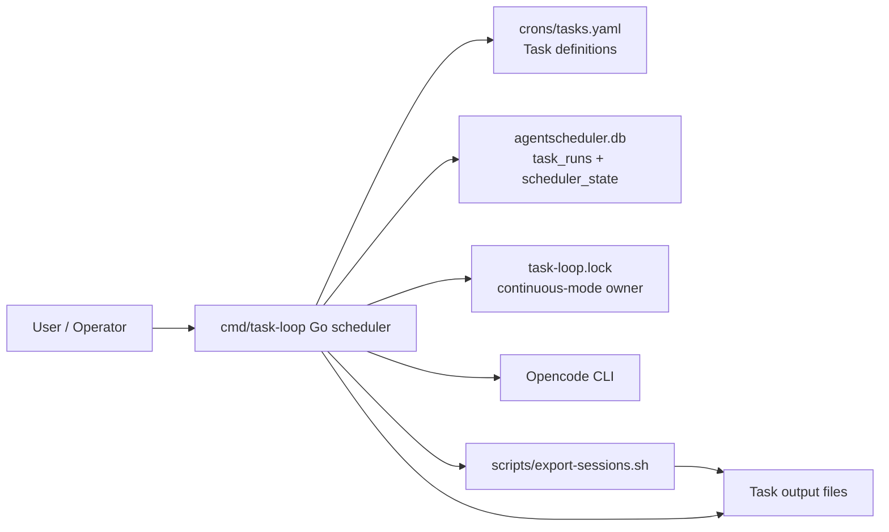
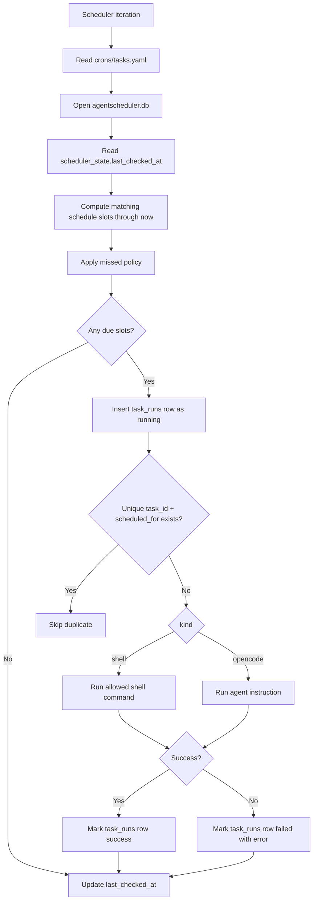

# Task and Scheduler Architecture

This document covers AgentScheduler's Go task runner: how tasks are stored, how to create a new task, how missed schedules are handled, and how runtime history is recorded in SQLite.

For the memory workflow built on top of these task primitives, see [`docs/memory-workflow.md`](memory-workflow.md).

## Quick answer map

| Question | Short answer |
|---|---|
| How are tasks stored individually? | As entries in the top-level `tasks:` array inside `crons/tasks.yaml`, not as separate files. |
| How can I create new tasks? | Add a YAML object to `crons/tasks.yaml` with `id`, `enabled`, `schedule`, optional `missed`, `kind`, and either `command` or `instruction`. |
| How do I know when a task last succeeded? | Query `agentscheduler.db`, specifically the newest `task_runs` row for the task with `status = 'success'`. |
| What was the outcome of a task? | Every attempt creates or updates a `task_runs` row with `scheduled_for`, `started_at`, `finished_at`, `status`, `duration_ms`, and optional `error`. |
| What does the cron scheduler do? | `cmd/task-loop` reads `crons/tasks.yaml`, computes due schedule slots since the last scheduler check, records attempts in SQLite, and executes due shell or Opencode work. |
| Can I run two continuous schedulers at once? | No. Continuous mode owns `task-loop.lock`; a second live scheduler exits instead of starting. |
| What is the default poll interval? | Five minutes (`300` seconds), configurable with `TASK_LOOP_POLL_SECONDS` or `--poll-seconds`. |
| What happens after the PC was offline? | The scheduler computes missed `scheduled_for` slots since `scheduler_state.last_checked_at` and applies each task's `missed` policy. |

## Diagrams

### System architecture



### Scheduler flow



## User guide

### Where tasks live

Current task definitions live in:

- `crons/tasks.yaml`

Each task is stored as one standard YAML object inside the top-level `tasks:` array. The Go scheduler parses this file with `gopkg.in/yaml.v3`, so normal YAML features such as quoted strings, block scalars, comments, booleans, and arrays are supported before task validation runs.

Example:

```yaml
tasks:
  - id: daily-export
    enabled: true
    schedule: "0 23 * * *"
    missed: run-latest
    kind: shell
    command: "./scripts/export-sessions.sh"
```

Important details:

- `crons/tasks.yaml` is the active source of truth for task definitions.
- The top-level value must be an object with a `tasks` array.
- Runtime execution history does not live in `crons/tasks.yaml`; it lives in `agentscheduler.db`.

### How to create a new task

Add another entry to the `tasks:` array in `crons/tasks.yaml`.

#### Agent task

Use an agent kind when the task should ask a local CLI agent to read, write, summarize, or inspect content. Supported agent kinds are `opencode`, `copilot-cli`, `claude`, `codex`, and `pi-agent`.

```yaml
  - id: weekday-summary
    enabled: true
    schedule: "30 8 * * 1-5"
    missed: run-latest
    kind: opencode
    model: github-copilot/gpt-5.5
    thinking: medium
    instruction: |
      Summarize the project status and write the result to docs/status.md.

  - id: codex-review
    enabled: true
    schedule: "0 10 * * 1"
    missed: run-latest
    kind: codex
    model: gpt-5.3-codex
    instruction: |
      Review the repository for risky changes and write notes to docs/codex-review.md.

  - id: claude-review
    enabled: true
    schedule: "30 10 * * 1"
    missed: run-latest
    kind: claude
    instruction: |
      Review the repository architecture and write notes to docs/claude-review.md.

  - id: copilot-summary
    enabled: true
    schedule: "0 11 * * 1"
    missed: run-latest
    kind: copilot-cli
    instruction: |
      Summarize the repository and write the result to docs/copilot-summary.md.

  - id: pi-audit
    enabled: true
    schedule: "30 11 * * 1"
    missed: run-latest
    kind: pi-agent
    instruction: |
      Audit the repository for maintainability issues and write notes to docs/pi-audit.md.
```

Each agent CLI must be installed and authenticated separately. This runner only schedules and launches the local binary; it does not install providers or manage API keys.

#### Shell task

Use `kind: shell` when the task should run an allowlisted local script command.

```yaml
  - id: export-sessions
    enabled: true
    schedule: "0 23 * * *"
    missed: run-latest
    kind: shell
    command: "./scripts/export-sessions.sh"
```

#### Required fields

| Field | Required | Description |
|---|---:|---|
| `id` | Yes | Stable unique task identifier. |
| `enabled` | Yes | Set to `true` to run or `false` to keep the task disabled. |
| `schedule` | Yes | Standard 5-field cron expression: `minute hour day-of-month month day-of-week`. |
| `missed` | No | Missed-run policy: `run-latest` by default, or `skip` / `catch-up`. |
| `kind` | Yes | One of `shell`, `opencode`, `copilot-cli`, `claude`, `codex`, or `pi-agent`. |
| `command` | For `shell` | Local command accepted by the scheduler's shell allowlist. |
| `instruction` | For agent kinds | Prompt text sent to the configured agent CLI after placeholder rendering. |
| `model` | No | Optional model override for an agent task; Opencode also supports `OPENCODE_TASK_MODEL` / `--model`. |
| `thinking` | No | Optional Opencode reasoning effort, passed as `--variant <thinking>`; only valid for `kind: opencode`. |

#### Missed-run policy

The scheduler only wakes every five minutes by default, and the PC may be asleep or offline. It therefore computes schedule slots between `last_checked_at` and `now` instead of checking only whether the current minute matches the cron expression.

| Policy | Behavior | Use when |
|---|---|---|
| `run-latest` | Run only the newest missed slot. This is the default. | The task should still happen after downtime, but old duplicate periods are not useful. |
| `skip` | Run only fresh slots inside the current poll window. Older missed slots are ignored. | Late work would be stale or annoying. |
| `catch-up` | Run every missed slot in chronological order. | Every period matters, such as backups or accounting exports. |

Strong default: use `run-latest`. Catching up every missed task after a week offline is usually a dumb surprise unless the task is explicitly designed for it.

#### Task creation checklist

1. Choose a unique, lowercase `id`.
2. Add the task object to `crons/tasks.yaml`.
3. Pick a 5-field cron `schedule`.
4. Choose the `missed` policy: usually `run-latest`, `skip` for stale work, or `catch-up` only when every scheduled period matters.
5. Choose `kind: shell` with `command`, or an agent kind with `instruction`.
6. Keep output paths explicit in the command or instruction.
7. Test due-slot matching with `go run ./cmd/task-loop --once --dry-run --at <ISO timestamp>`.
8. Run one real scheduler pass only when the expected task slot should be due.
9. Inspect recent attempts with `sqlite3 agentscheduler.db 'select task_id, scheduled_for, status, error from task_runs order by started_at desc limit 20;'`.

Built-in tasks may use `YYYY-MM-DD` or `YYYY-Www` placeholders, which the scheduler resolves against the `scheduled_for` slot at run time.

### How to run the scheduler

```bash
go run ./cmd/task-loop
```

In continuous mode, the scheduler creates `task-loop.lock` before entering the poll loop. The lock file contains JSON with `pid` and `started_at`, so a later scheduler can tell whether the recorded owner is still live. If the PID is live, the new scheduler exits. If the PID is stale, the stale lock is removed and replaced.

Useful commands:

```bash
# Run continuously, polling every five minutes by default
go run ./cmd/task-loop

# Run one scheduler iteration
go run ./cmd/task-loop --once

# Test due-slot matching without executing tasks or writing runtime state
go run ./cmd/task-loop --once --dry-run --at 2026-03-07T23:15:00Z

# Poll every five minutes explicitly
go run ./cmd/task-loop --poll-seconds 300
```

Runtime history is stored in `agentscheduler.db`. This file is machine-managed and should not be edited by hand outside intentional SQLite maintenance.

### Runtime database

The scheduler initializes these tables automatically:

```sql
CREATE TABLE task_runs (
  id INTEGER PRIMARY KEY AUTOINCREMENT,
  task_id TEXT NOT NULL,
  scheduled_for TEXT NOT NULL,
  started_at TEXT NOT NULL,
  finished_at TEXT,
  status TEXT NOT NULL CHECK (status IN ('running', 'success', 'failed', 'skipped')),
  error TEXT,
  duration_ms INTEGER,
  UNIQUE(task_id, scheduled_for)
);

CREATE TABLE scheduler_state (
  key TEXT PRIMARY KEY,
  value TEXT NOT NULL
);
```

The unique `(task_id, scheduled_for)` constraint is the duplicate-run guard. It is clearer than the old `last_run` field because it records the exact cron occurrence being handled, even if the PC was offline and the task starts late.

Example query for the last success of a task:

```sql
SELECT scheduled_for, finished_at
FROM task_runs
WHERE task_id = 'daily-analysis' AND status = 'success'
ORDER BY scheduled_for DESC
LIMIT 1;
```

Example query for recent failures:

```sql
SELECT task_id, scheduled_for, error
FROM task_runs
WHERE status = 'failed'
ORDER BY started_at DESC
LIMIT 20;
```

## Developer notes

The active scheduler implementation in this repository is `cmd/task-loop/main.go`.

Important implementation details:

- Cron matching supports standard 5-field expressions with `*`, lists, ranges, and steps.
- Day-of-week accepts both `0` and `7` as Sunday.
- Schedule slots are evaluated in UTC.
- Duplicate runs are blocked by the SQLite unique key on `(task_id, scheduled_for)`.
- Shell tasks are restricted by an allowlist and lightweight quote/escape parsing before execution.
- `kind: opencode` tasks run `opencode run -m <model> [--variant <thinking>] <instruction>`.
- `kind: copilot-cli`, `claude`, `codex`, and `pi-agent` tasks run the matching CLI binary in non-interactive mode.
- `OPENCODE_TASK_MODEL` or `--model` selects the default model only for `kind: opencode` tasks; use task-level `model` or per-agent environment variables for other agent kinds.
- `thinking` is supported only for `kind: opencode` and maps to Opencode's provider-specific `--variant` flag.
- The preferred Opencode task model is `zen/minimax2.5-free`; when unavailable and `opencode/minimax-m2.5-free` is configured, the scheduler falls back automatically.
- `--once` mode skips the continuous scheduler lock because it runs a single foreground iteration and exits.
- `--dry-run` does not execute tasks and does not create or update `agentscheduler.db`.

## FAQ

### Can tasks live in separate files?

Not today. All tasks currently live in the top-level `tasks:` array in `crons/tasks.yaml`. Splitting tasks into files such as `crons/tasks/*.yaml` is a future improvement idea.

### What cron syntax is supported?

Tasks use standard 5-field cron syntax: `minute hour day-of-month month day-of-week`, with `*`, comma-separated lists, ranges, and step values.

### What happens if the scheduler wakes five minutes late?

It still runs matching slots between `last_checked_at` and `now`, subject to the task's `missed` policy. A task scheduled for `23:15` can run at `23:20` and still records `scheduled_for = 23:15`.

### What happens when a task fails?

The `task_runs` row for that `(task_id, scheduled_for)` is marked `failed`, with a short error message and duration. The row remains in the database, so the scheduler will not blindly retry the same scheduled slot in the same normal pass.

### Can I run two schedulers at the same time?

No. Continuous mode uses `task-loop.lock` to prevent a second live scheduler from starting. `--once` runs do not acquire the lock.

### Do shell tasks run arbitrary shell strings?

No. The Go scheduler applies placeholder rendering, an allowlist, and quote/escape parsing before running `kind: shell` commands. Do not loosen this casually; arbitrary shell cron strings are foot-guns.

### Is there a task-run database?

Yes. Runtime history is stored in `agentscheduler.db` using SQLite.

## Architecture improvement ideas

These are the highest-value improvements left after the Go + SQLite scheduler rewrite.

### Split tasks into one file per task

Current state:

- all tasks live in one YAML file: `crons/tasks.yaml`

Why improve it:

- clearer ownership
- simpler diffs
- easier review of large instructions
- easier per-task testing and tooling

A future shape could be something like `crons/tasks/*.yaml`.

### Separate long prompts from task metadata

Current state:

- schedules, kinds, missed-run policies, and Opencode instructions all live together in `crons/tasks.yaml`

Why improve it:

- makes prompt changes explicit and reviewable
- keeps task config shorter
- makes prompts easier to test

### Add status tooling

Current state:

- SQLite stores structured history, but status inspection is still manual through `sqlite3`

Why improve it:

- a `task-loop status` or `agentscheduler tasks status` command would make failures easier to spot
- canned queries would avoid typo-prone manual SQL
- summaries could show last success, last failure, and currently running rows per task

### Harden the scheduler

Current test coverage includes unit tests for cron slot matching and missed-run policy selection, plus integration-style tests that exercise scheduler iterations against temporary task files, shell scripts, and SQLite databases.

Remaining scheduler hardening priorities:

- more cron parser edge cases, especially invalid expressions and Sunday `0`/`7` behavior
- a migration path from old `task-state.json` files if anyone has long-lived state they care about
- bounded catch-up limits for tasks that might generate huge backlogs
- better operational logging and metrics

## File reference

| Purpose | File |
|---|---|
| Active task definitions | `crons/tasks.yaml` |
| Runtime task history | `agentscheduler.db` |
| Scheduler implementation | `cmd/task-loop/main.go` |
| Continuous scheduler lock | `task-loop.lock` |
| Session export script | `scripts/export-sessions.sh` |
| Memory workflow guide | `docs/memory-workflow.md` |
