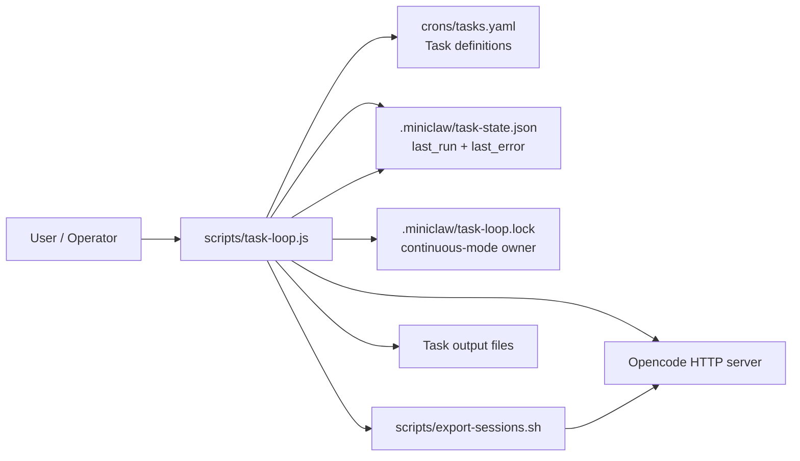
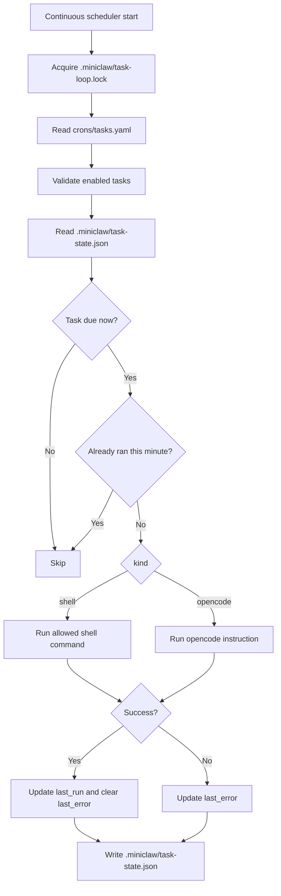

# Task and Scheduler Architecture

This document covers MiniClaw's task runner: how tasks are stored, how to create a new task, how the scheduler runs, and how runtime state is recorded.

For the memory workflow built on top of these task primitives, see [`docs/memory-workflow.md`](memory-workflow.md).

## Quick answer map

| Question | Short answer |
|---|---|
| How are tasks stored individually? | As entries in the top-level `tasks:` array inside `crons/tasks.yaml`, not as separate files. |
| How can I create new tasks? | Add a new YAML object to `crons/tasks.yaml` with `id`, `enabled`, `schedule`, `kind`, and either `command` or `instruction`. |
| How do I know when a task last succeeded? | Check that task's `last_run` field in `.miniclaw/task-state.json`. |
| What was the outcome of a task? | Success updates `last_run` and clears `last_error`; failure updates `last_error`; artifacts are the files the task changes. |
| What does the cron scheduler do? | `scripts/task-loop.js` reads `crons/tasks.yaml`, checks `.miniclaw/task-state.json`, runs due tasks, and writes updated runtime state back to disk. |
| Can I run two continuous schedulers at once? | No. Continuous mode owns `.miniclaw/task-loop.lock`; a second live scheduler exits instead of starting. |
| Is the scheduler already written in Go? | No. The active implementation in this repo is still `scripts/task-loop.js`; a Go rewrite is only listed as future backlog work. |
| What is `crons/tasks.yaml` for? | It is the active source of truth for task definitions, schedules, and Opencode instructions or shell commands. |
| Why does MiniClaw use the Opencode web server? | It uses Opencode's supported HTTP interface instead of coupling MiniClaw to an internal database schema. |

## Diagrams

### System architecture



### Scheduler flow



## User guide

### Where tasks live

Current task definitions live in:

- `crons/tasks.yaml`

Each task is stored as one standard YAML object inside the top-level `tasks:` array. The scheduler parses this file with `js-yaml`, so normal YAML features such as quoted strings, block scalars, comments, booleans, and arrays are supported before task validation runs.

Example:

```yaml
tasks:
  - id: daily-export
    enabled: true
    schedule: "0 23 * * *"
    kind: shell
    command: "./scripts/export-sessions.sh"
```

Important details:

- `crons/tasks.yaml` is the active source of truth for task definitions.
- The top-level value must be an object with a `tasks` array.
- Runtime state does not live in `crons/tasks.yaml`; it lives in `.miniclaw/task-state.json`.

### How to create a new task

Add another entry to the `tasks:` array in `crons/tasks.yaml`.

#### Opencode task

Use `kind: opencode` when the task should ask Opencode to read, write, summarize, or inspect content.

```yaml
  - id: weekday-summary
    enabled: true
    schedule: "30 8 * * 1-5"
    kind: opencode
    instruction: |
      Summarize the project status and write the result to docs/status.md.
```

#### Shell task

Use `kind: shell` when the task should run an allowlisted local script command.

```yaml
  - id: export-sessions
    enabled: true
    schedule: "0 23 * * *"
    kind: shell
    command: "./scripts/export-sessions.sh"
```

#### Required fields

| Field | Required | Description |
|---|---:|---|
| `id` | Yes | Stable unique task identifier. |
| `enabled` | Yes | Set to `true` to run or `false` to keep the task disabled. |
| `schedule` | Yes | Standard 5-field cron expression: `minute hour day-of-month month day-of-week`. |
| `kind` | Yes | Either `shell` or `opencode`. |
| `command` | For `shell` | Local command accepted by the scheduler's shell allowlist. |
| `instruction` | For `opencode` | Prompt text sent to `opencode run` after placeholder rendering. |

#### Task creation checklist

1. Choose a unique, lowercase `id`.
2. Add the task object to `crons/tasks.yaml`.
3. Pick a 5-field cron `schedule`.
4. Choose `kind: shell` with `command` or `kind: opencode` with `instruction`.
5. Keep output paths explicit in the command or instruction.
6. Test due-task matching with `node scripts/task-loop.js --once --dry-run --at <ISO timestamp>`.
7. Run one real scheduler pass only when the expected task should be due.

Built-in tasks may use `YYYY-MM-DD` or `YYYY-Www` placeholders, which the scheduler resolves at run time.

### How to run the scheduler

```bash
node scripts/task-loop.js
```

In continuous mode, the scheduler creates `.miniclaw/task-loop.lock` before entering the poll loop. The lock file contains JSON with `pid` and `started_at`, so a later scheduler can tell whether the recorded owner is still live. If the PID is live, the new scheduler refuses to start. If the PID is gone, the stale lock is removed and replaced. The lock is cleaned up on normal process exit and handled termination signals.

Useful modes:

```bash
# Single scheduler pass
node scripts/task-loop.js --once

# Check what would run without side effects
node scripts/task-loop.js --once --dry-run --at 2026-03-07T23:15:00Z
```

### How to know when a task last ran successfully

Look at the task entry in:

- `.miniclaw/task-state.json`

Example:

```json
{
  "daily-export": {
    "last_run": "2026-03-07T23:34:49.822Z",
    "last_error": null
  }
}
```

Important details:

- If a task has never succeeded, it may have no entry yet.
- A failure does **not** clear `last_run`.
- `last_run` is therefore the most recent **successful** run, not merely the most recent attempt.

### How to see the outcome of a task

MiniClaw currently tracks outcome in a lightweight way.

Inside `.miniclaw/task-state.json`:

- Success updates `last_run` and clears `last_error`.
- Failure updates `last_error` with a timestamped message.

Example failure metadata:

```json
{
  "daily-analysis": {
    "last_run": "2026-03-07T23:15:01.000Z",
    "last_error": "2026-04-25T18:00:00.000Z — OpenCode task failed: ..."
  }
}
```

There is no separate task-run database or structured run log yet. Task output is the file the task changes, so inspect the expected output path named in the task definition.

## Developer guide

### Scheduler architecture

The active scheduler implementation in this repository is `scripts/task-loop.js`.

Important clarification:

- There is **not** a Go scheduler checked into this repo today.
- Current runtime behavior refers to the JavaScript implementation.

At a high level it does this:

1. In continuous mode, acquire `.miniclaw/task-loop.lock` before the first scheduler iteration.
2. Read `crons/tasks.yaml`.
3. Parse standard YAML with `js-yaml` and require a top-level `tasks` array.
4. Validate each task's object shape, `id`, `enabled`, `schedule`, `kind`, and `command` or `instruction`.
5. Read `.miniclaw/task-state.json`.
6. Find tasks whose cron expression matches the current minute.
7. Skip any task that already ran in that exact minute slot.
8. Execute the task directly as either `shell` or `opencode`.
9. Update `last_run` on success, or `last_error` on failure.
10. Write the updated state back to `.miniclaw/task-state.json`.

Key implementation details:

- Task parsing is handled by `readTasks()` with `js-yaml`; task shape checks are handled by `validateTask(...)`.
- Runtime state is handled by `readState()` and `writeState(...)`.
- Continuous-mode locking is handled by `acquireSchedulerLock()` and `releaseSchedulerLock(...)`.
- Due-task matching is handled by `cronMatches(...)`.
- Duplicate same-minute runs are blocked by `alreadyRanThisSlot(...)`.
- Shell tasks are restricted by `shellCommandAllowed(...)` and metacharacter checks.
- The scheduler is poll-based, not OS-cron based. By default it loops every 60 seconds.
- `--once` mode skips the lock because it runs a single foreground iteration and exits.

### What the cron scheduler actually does

`node scripts/task-loop.js` is a long-running poll loop.

It is responsible for:

- deciding which enabled tasks are due now
- executing `kind: shell` tasks directly
- executing `kind: opencode` tasks by sending their instruction text to Opencode
- recording success or failure into `.miniclaw/task-state.json`
- preventing two live continuous scheduler loops from running from the same checkout

It is **not** currently responsible for:

- per-run structured logs
- artifact indexing
- rich observability or metrics

### Why MiniClaw uses the Opencode web server

MiniClaw currently talks to Opencode through the local HTTP server rather than querying a local database directly.

Why this is the current design:

- It uses Opencode's supported interface instead of relying on internal storage details.
- The project can health-check the server with `/global/health` before making requests.
- Authentication is handled consistently through the HTTP layer.
- MiniClaw does not need to know where Opencode stores data on disk.
- MiniClaw is less exposed to schema changes across Opencode versions.

Could MiniClaw read a local DB instead? Possibly, but it is currently discouraged unless you are willing to own the coupling.

Trade-offs of the DB approach:

- tighter coupling to Opencode internals
- risk that upgrades change the schema or storage location
- more work around locking, migrations, and partial writes
- no current DB adapter or documented contract in this repo

So the short version is: querying a local DB could work as a future architecture option, but the web server is the safer integration boundary for this project today.

### Where task prompts live

The current source of truth for each `kind: opencode` task is its `instruction` text in `crons/tasks.yaml`.

The scheduler no longer compiles task prose into another format first. Instead:

- `kind: shell` tasks run the configured `command` after placeholder rendering, shell allowlist checks, and unsafe shell syntax rejection.
- `kind: opencode` tasks send the rendered `instruction` to `opencode run`.
- `OPENCODE_TASK_MODEL` or `--model` selects the model only for `kind: opencode` tasks; shell tasks do not use this model setting.

For developers, that means:

- Task definitions and prompts live in `crons/tasks.yaml`.
- Runtime execution metadata lives separately in `.miniclaw/task-state.json`.
- Editing the state file changes run metadata, not task behavior.

## FAQ

### Can tasks live in separate files?

Not today. All tasks currently live in the top-level `tasks:` array in `crons/tasks.yaml`. Splitting tasks into files such as `crons/tasks/*.yaml` is a future improvement idea.

### What cron syntax is supported?

Tasks use standard 5-field cron syntax: `minute hour day-of-month month day-of-week`.

### What happens if a task is due more than once in the same minute?

The scheduler records successful runs by minute slot and skips a task that already succeeded in that exact slot.

### What happens when a task fails?

The task's `last_error` field in `.miniclaw/task-state.json` is updated with a timestamped message. The previous `last_run` remains intact because it represents the most recent successful run.

### Can I run two schedulers at the same time?

No. Continuous mode uses `.miniclaw/task-loop.lock` to prevent a second live scheduler from starting. `--once` runs do not acquire the lock.

### Do shell tasks run arbitrary shell strings?

No. `scripts/task-loop.js` applies placeholder rendering, an allowlist, and unsafe shell syntax rejection before running `kind: shell` commands.

### Which model runs Opencode tasks?

The preferred Opencode task model is `zen/minimax2.5-free`. When that model is unavailable and `opencode/minimax-m2.5-free` is configured, the scheduler falls back automatically. You can override the model with `OPENCODE_TASK_MODEL=provider/model` or `--model provider/model`.

### Is there a task-run database?

No. Runtime state is tracked in `.miniclaw/task-state.json`. There is no structured run-history database yet.

## Architecture improvement ideas

These are the highest-value improvements suggested by the current implementation.

### Split tasks into one file per task

Current state:

- all tasks live in one YAML file: `crons/tasks.yaml`

Why improve it:

- clearer ownership
- simpler diffs
- easier review of large instructions
- easier per-task testing and tooling

A future shape could be something like `crons/tasks/*.yaml`.

### Separate long prompts from task metadata

Current state:

- schedules, kinds, and Opencode instructions all live together in `crons/tasks.yaml`
- runtime state already lives separately in `.miniclaw/task-state.json`

Why improve it:

- makes prompt changes explicit and reviewable
- keeps task config shorter
- makes prompts easier to test

### Add structured run history

Current state:

- only `last_run` and optional `last_error` are stored

Why improve it:

- easier debugging
- clearer success/failure history
- artifact discovery becomes trivial

A simple approach would be a JSONL run log per task.

### Harden the scheduler

Scheduler hardening priorities:

- tests for cron parsing and due-task detection
- safe handling for invalid state or task config
- better operational logging and metrics

## File reference

| Purpose | File |
|---|---|
| Active task definitions | `crons/tasks.yaml` |
| Runtime task state | `.miniclaw/task-state.json` |
| Scheduler implementation | `scripts/task-loop.js` |
| Session export script | `scripts/export-sessions.sh` |
| Memory workflow guide | `docs/memory-workflow.md` |
