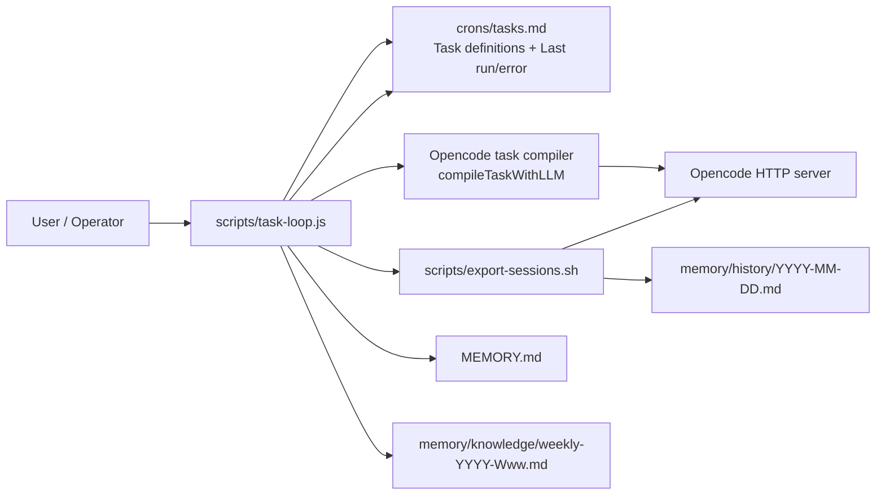
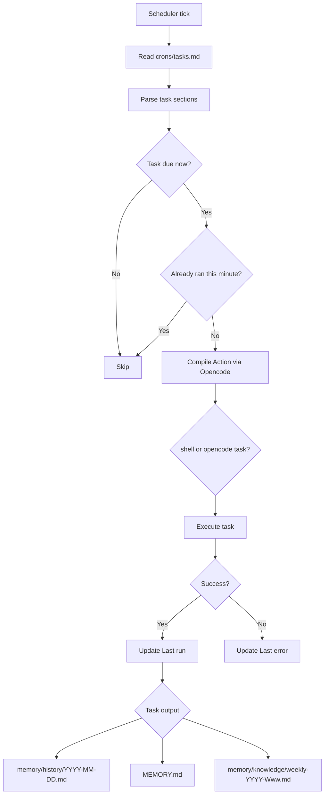

# Tasks, Scheduler, and Memory

This document covers both sides of MiniClaw:

- **User guide:** how to add and inspect tasks, and where task output appears.
- **Developer guide:** how the scheduler works, how memory is layered, where prompts live, and what should be improved.

## Quick answer map

| Question | Short answer |
|---|---|
| How are tasks stored individually? | As individual `## task-name` sections inside `crons/tasks.md`, not as separate files. |
| How can I create new tasks? | Add a new section to `crons/tasks.md` with `Schedule`, `Action`, and `Last run`. |
| How do I know when a task last succeeded? | Check that task's `- **Last run:**` value in `crons/tasks.md`. |
| What was the outcome of a task? | Success updates `Last run`; failure appends or updates `Last error`; artifacts are the files the task changes. |
| What does the cron scheduler do? | `scripts/task-loop.js` polls for due tasks, compiles each task's `Action`, runs it, and updates task metadata. |
| Why does MiniClaw use the Opencode webserver? | It uses Opencode's supported HTTP interface instead of coupling MiniClaw to an internal database schema. |
| Why do daily and weekly memory exist? | Daily history keeps raw transcripts. Weekly notes keep higher-level summaries without loading every daily file. |
| Where are the prompts for memory compression tasks? | The task instructions live in `crons/tasks.md`; the generic compile prompt lives in `scripts/task-loop.js`; `scheduler/tasks.yaml` contains prompts but is currently unused. |
| How do I prevent memory pollution? | Keep `MEMORY.md` short, move long notes to `memory/knowledge/`, strike outdated facts instead of silently changing them, and keep raw history in `memory/history/`. |

## Diagrams

### System architecture



### Scheduler and memory flow



## User guide

### 1. Where tasks live

Current task definitions live in one file:

- `crons/tasks.md`

Each task is stored as its own Markdown section. Example:

```md
## daily-export
- **Schedule:** `0 23 * * *`
- **Action:** Run `scripts/export-sessions.sh` to fetch all of today's Opencode sessions.
- **Last run:** 2026-03-07T23:34:49.822Z
```

So the project has **individually defined tasks**, but they are grouped into one Markdown document rather than one file per task.

### 2. How to create a new task

Add another section to `crons/tasks.md` using the same shape:

```md
## my-task
- **Schedule:** `30 8 * * 1-5`
- **Action:** Describe the job in plain English, including which files it should read or write.
- **Last run:** _(never)_
```

Notes:

- `Schedule` uses standard 5-field cron syntax: `minute hour day-of-month month day-of-week`.
- `Action` should be explicit about inputs, outputs, and file paths.
- `Last run` starts as `_(never)_` until the task succeeds.
- You do **not** need to add code for every new task, but tasks are more reliable when their action is specific and deterministic.

### 3. How to run the scheduler

```bash
node scripts/task-loop.js
```

Useful modes:

```bash
# Single scheduler pass
node scripts/task-loop.js --once

# Check what would run without side effects
node scripts/task-loop.js --once --dry-run --at 2026-03-07T23:15:00Z
```

### 4. How to know when a task last ran successfully

Look at the task block in `crons/tasks.md`:

- `- **Last run:** <timestamp>` means the task completed successfully at that time.
- `- **Last run:** _(never)_` means there is no recorded successful execution yet.

Important detail:

- A failure **does not** clear `Last run`.
- This means `Last run` is the most recent **successful** run, not merely the most recent attempt.

### 5. How to see the outcome of a task

MiniClaw currently tracks outcome in a lightweight way.

#### Status

Inside each task section in `crons/tasks.md`:

- success: `Last run` is updated
- failure: `Last error` is appended or updated

Example failure metadata:

```md
- **Last error:** 2026-04-25T18:00:00.000Z — Shell task failed: ...
```

There is no separate task-run database or structured status log yet.

#### Artifacts

Task output is the file the task changes.

Current built-in examples:

- `daily-export` writes `memory/history/YYYY-MM-DD.md`
- `daily-analysis` updates `MEMORY.md` and the `## Summary` section in `memory/history/YYYY-MM-DD.md`
- `weekly-review` writes `memory/knowledge/weekly-YYYY-Www.md`

To inspect what a task produced, check the expected output file named in the task description and the surrounding architecture docs.

## Developer guide

### 6. Scheduler architecture

The scheduler implementation is `scripts/task-loop.js`.

At a high level it does this:

1. Read `crons/tasks.md`
2. Split the file into `## ...` task sections
3. Parse each task's `Schedule`, `Action`, `Last run`, and optional `Last error`
4. Find tasks whose cron expression matches the current minute
5. Skip any task that already ran in that exact minute slot
6. Compile the task `Action` into executable work using Opencode
7. Execute the compiled task
8. Update `Last run` on success, or `Last error` on failure
9. Write the updated metadata back to `crons/tasks.md`

Key implementation details:

- Due-task matching is handled by `cronMatches(...)`.
- Duplicate same-minute runs are blocked by `alreadyRanThisSlot(...)`.
- Metadata rewriting is handled by `updateTaskMetadata(...)`.
- The scheduler is poll-based, not OS-cron based. By default it loops every 60 seconds.

### 7. What the cron scheduler actually does

`node scripts/task-loop.js` is a long-running poll loop.

It is responsible for:

- deciding which tasks are due now
- translating human-readable task actions into executable instructions
- executing either shell commands or Opencode reasoning tasks
- recording success or failure back into `crons/tasks.md`

It is **not** currently responsible for:

- per-run structured logs
- artifact indexing
- file locking or single-instance protection
- rich observability or metrics

Those gaps are also reflected in `implementation-backlog.md`.

### 7a. Why MiniClaw uses the Opencode webserver

MiniClaw currently talks to Opencode through the local HTTP server rather than querying a local database directly.

Why this is the current design:

- it uses Opencode's supported interface instead of relying on internal storage details
- the project can health-check the server with `/global/health` before making requests
- authentication is already handled consistently through the HTTP layer
- MiniClaw does not need to know where Opencode stores data on disk
- MiniClaw is less exposed to schema changes across Opencode versions

Could MiniClaw read a local DB instead? Possibly, but it is currently disadvised unless you are willing to own the coupling.

Trade-offs of the DB approach:

- tighter coupling to Opencode internals
- risk that upgrades change the schema or storage location
- more work around locking, migrations, and partial writes
- no current DB adapter or documented contract in this repo

So the short version is: querying a local DB could work as a future architecture option, but the webserver is the safer integration boundary for this project today.

### 8. Why daily and weekly memory both exist

MiniClaw intentionally separates memory by time horizon and importance.

#### Daily memory: `memory/history/YYYY-MM-DD.md`

Purpose:

- raw export of the day's Opencode sessions
- full transcript record
- audit trail for what happened on a specific day

Why it exists:

- raw detail is useful for recovery, debugging, and later analysis
- it should not all be loaded into every future session

#### Weekly memory: `memory/knowledge/weekly-YYYY-Www.md`

Purpose:

- higher-level summary across multiple daily files
- a way to retain cross-day patterns without reopening every raw history file

Why it exists:

- daily logs are too detailed for routine reuse
- weekly summaries are a compression layer between raw history and durable memory

#### Durable memory: `MEMORY.md`

Purpose:

- small, always-loaded memory for preferences, decisions, lessons, and follow-ups

Why it exists:

- the assistant needs a stable short context window
- long transcripts would pollute context and reduce quality

### 9. Where the memory-compression prompts are

There are three places worth knowing about.

#### A. Task instructions in `crons/tasks.md`

The current source of truth for what `daily-analysis` and `weekly-review` should do is their `Action` text in `crons/tasks.md`.

That means the memory-compression behavior is currently described as task prose, not as versioned prompt files.

#### B. Generic compiler prompt in `scripts/task-loop.js`

The scheduler wraps each task with a generic prompt in `compileTaskWithLLM(...)`.

That prompt tells Opencode to convert the task action into JSON of this shape:

```json
{"type":"opencode"|"shell","payload":"...","reason":"..."}
```

So there is a generic execution prompt in code, but not a dedicated file for each memory task.

#### C. `scheduler/tasks.yaml`

This file contains prompt-like text:

- `daily-export`
- `daily-analysis`
- `weekly-review`

But the current codebase does **not** reference `scheduler/tasks.yaml`.

For developers, that means:

- it is not the active source of truth right now
- editing it will not change scheduler behavior unless the code is updated to load it

### 10. How to keep memory from getting polluted over time

The current architecture already has some guardrails.

#### Existing guardrails

From `AGENTS.md` and `MEMORY.md`:

- keep `MEMORY.md` concise
- append one-line entries under the correct heading
- never delete old entries silently; strike through outdated ones instead
- move longer notes into `memory/knowledge/<topic>.md`
- keep raw transcripts in `memory/history/`, not in always-loaded memory
- use `memory/facts.md` as a scratch pad for short-lived reminders

#### Practical operating rules

If you want clean long-term memory, follow this discipline:

1. Put only durable facts into `MEMORY.md`
2. Keep session detail in `memory/history/`
3. Move long-form analysis into `memory/knowledge/`
4. Strike through stale entries in `MEMORY.md` instead of rewriting history
5. Review weekly notes before promoting anything into durable memory
6. Avoid storing temporary task output in always-loaded files

#### Current limitation

This project relies on human and prompt discipline. It does **not** yet enforce:

- a hard size budget for `MEMORY.md`
- automatic pruning or archival
- deduplication of repeated facts
- confidence scoring for promoted memories

## Architecture improvement ideas

These are the highest-value improvements suggested by the current implementation.

### 1. Split tasks into one file per task

Current state:

- all tasks live in `crons/tasks.md`

Why improve it:

- clearer ownership
- simpler diffs
- easier per-task metadata and prompts
- easier testing and tooling

A future shape could be something like `crons/tasks/*.md` or `crons/tasks/*.yaml`.

### 2. Separate prompts from task metadata

Current state:

- behavior is partly in `crons/tasks.md`
- the compile prompt is embedded in `scripts/task-loop.js`
- `scheduler/tasks.yaml` looks like prompt config, but is unused

Why improve it:

- makes prompt changes explicit and reviewable
- avoids confusion about the active source of truth
- makes memory-compression prompts easier to test

### 3. Add structured run history

Current state:

- only `Last run` and optional `Last error` are stored

Why improve it:

- easier debugging
- clearer success/failure history
- artifact discovery becomes trivial

A simple approach would be a Markdown or JSONL run log per task.

### 4. Add memory hygiene automation

Current state:

- memory quality depends on discipline

Why improve it:

- prevents `MEMORY.md` from growing past useful context size
- reduces duplication and stale facts

Examples:

- enforce a per-section entry cap
- archive struck-through lines automatically
- add a weekly dedupe pass before promoting new memories
- track source links back to history files

### 5. Harden the scheduler

The backlog already points at the main issues:

- single-instance locking
- tests for cron parsing and metadata updates
- safer handling of oversized or invalid LLM compiler output
- better operational logging and metrics

## File reference

| Purpose | File |
|---|---|
| Task definitions and run metadata | `crons/tasks.md` |
| Scheduler implementation | `scripts/task-loop.js` |
| Session export script | `scripts/export-sessions.sh` |
| Durable synthesised memory | `MEMORY.md` |
| Daily raw history | `memory/history/YYYY-MM-DD.md` |
| Weekly or topical long-form notes | `memory/knowledge/` |
| Current, unused prompt-like task config | `scheduler/tasks.yaml` |
| Hardening and architecture follow-ups | `implementation-backlog.md` |
