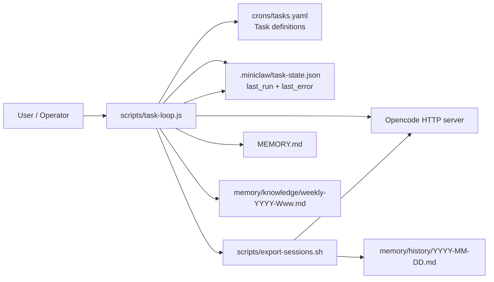
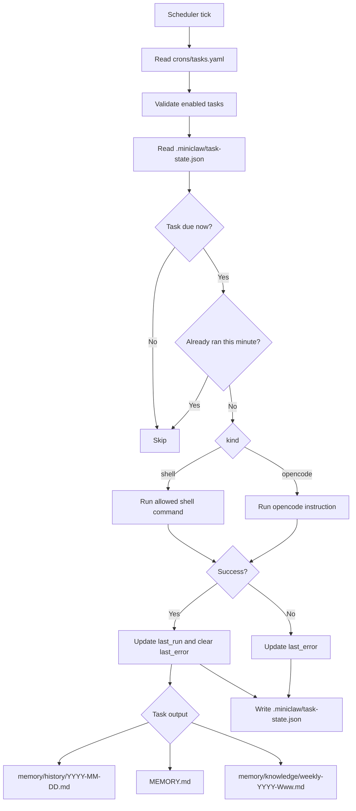

# Tasks, Scheduler, and Memory

This document covers both sides of MiniClaw:

- **User guide:** how to add and inspect tasks, and where task output appears.
- **Developer guide:** how the scheduler works today, where prompts live, and what should be improved.

## Quick answer map

| Question | Short answer |
|---|---|
| How are tasks stored individually? | As entries in the top-level `tasks:` array inside `crons/tasks.yaml`, not as separate files. |
| How can I create new tasks? | Add a new YAML object to `crons/tasks.yaml` with `id`, `enabled`, `schedule`, `kind`, and either `command` or `instruction`. |
| How do I know when a task last succeeded? | Check that task's `last_run` field in `.miniclaw/task-state.json`. |
| What was the outcome of a task? | Success updates `last_run` and clears `last_error`; failure updates `last_error`; artifacts are the files the task changes. |
| What does the cron scheduler do? | `scripts/task-loop.js` reads `crons/tasks.yaml`, checks `.miniclaw/task-state.json`, runs due tasks, and writes updated runtime state back to disk. |
| Is the scheduler already written in Go? | No. The active implementation in this repo is still `scripts/task-loop.js`; a Go rewrite is only listed as future backlog work. |
| What is `crons/tasks.yaml` for? | It is the active source of truth for task definitions, schedules, and Opencode instructions or shell commands. |
| Why does MiniClaw use the Opencode web server? | It uses Opencode's supported HTTP interface instead of coupling MiniClaw to an internal database schema. |
| Why do daily and weekly memory exist? | Daily history keeps raw transcripts. Weekly notes keep higher-level summaries without loading every daily file. |
| Where are the prompts for memory compression tasks? | In the `instruction` fields of `crons/tasks.yaml` for `kind: opencode` tasks. |
| How do I prevent memory pollution? | Keep `MEMORY.md` short, move long notes to `memory/knowledge/`, strike outdated facts instead of silently changing them, and keep raw history in `memory/history/`. |

## Diagrams

### System architecture



### Scheduler and memory flow



## User guide

### 1. Where tasks live

Current task definitions live in:

- `crons/tasks.yaml`

Each task is stored as one standard YAML object inside the top-level `tasks:` array. The scheduler parses this file with `js-yaml`, so normal YAML features such as quoted strings, block scalars, comments, booleans, and arrays are supported before task validation runs. Example:

```yaml
tasks:
  - id: daily-export
    enabled: true
    schedule: "0 23 * * *"
    kind: shell
    command: "./scripts/export-sessions.sh"
```

Important detail:

- `crons/tasks.yaml` is the active source of truth for task definitions
- the file uses standard YAML parsed by `js-yaml`; the top-level value must be an object with a `tasks` array

### 2. How to create a new task

Add another entry to `crons/tasks.yaml` using the same shape:

```yaml
  - id: my-task
    enabled: true
    schedule: "30 8 * * 1-5"
    kind: opencode
    instruction: |
      Describe exactly what the task should read, write, or summarize.
```

Notes:

- `schedule` uses standard 5-field cron syntax: `minute hour day-of-month month day-of-week`
- `kind` must be either `shell` or `opencode`
- `shell` tasks use a `command` field
- `opencode` tasks use an `instruction` field
- disabled tasks can stay in the file with `enabled: false`
- built-in tasks may use `YYYY-MM-DD` or `YYYY-Www` placeholders, which the scheduler resolves at run time

### 3. How to run the scheduler

```bash
node scripts/task-loop.js
```

Useful modes:

```bash
# Single scheduler pass
node scripts/task-loop.js --once

# Check what would run without side effects
node scripts/task-loop.js --once --dry-run --at 2026-03-07T23:15:00Z
```

### 4. How to know when a task last ran successfully

Look at the task entry in:

- `.miniclaw/task-state.json`

Example:

```json
{
  "daily-export": {
    "last_run": "2026-03-07T23:34:49.822Z",
    "last_error": null
  }
}
```

Important detail:

- if a task has never succeeded, it may have no entry yet
- a failure does **not** clear `last_run`
- `last_run` is therefore the most recent **successful** run, not merely the most recent attempt

### 5. How to see the outcome of a task

MiniClaw currently tracks outcome in a lightweight way.

#### Status

Inside `.miniclaw/task-state.json`:

- success: `last_run` is updated and `last_error` is cleared
- failure: `last_error` is updated with a timestamped message

Example failure metadata:

```json
{
  "daily-analysis": {
    "last_run": "2026-03-07T23:15:01.000Z",
    "last_error": "2026-04-25T18:00:00.000Z — OpenCode task failed: ..."
  }
}
```

There is no separate task-run database or structured run log yet.

#### Artifacts

Task output is the file the task changes.

Current built-in examples:

- `daily-export` writes `memory/history/YYYY-MM-DD.md`
- `daily-analysis` updates `MEMORY.md` and the `## Summary` section in `memory/history/YYYY-MM-DD.md`
- `weekly-review` writes `memory/knowledge/weekly-YYYY-Www.md`

To inspect what a task produced, check the expected output file named in the task definition and the surrounding architecture docs.

## Developer guide

### 6. Scheduler architecture

The active scheduler implementation in this repository is `scripts/task-loop.js`.

Important clarification:

- there is **not** a Go scheduler checked into this repo today
- `implementation-backlog.md` lists a future item to rewrite the task loop in Go
- so any current runtime behavior described here refers to the JavaScript implementation

At a high level it does this:

1. Read `crons/tasks.yaml`
2. Parse standard YAML with `js-yaml` and require a top-level `tasks` array
3. Validate each task's object shape, `id`, `enabled`, `schedule`, `kind`, and `command` or `instruction`
4. Read `.miniclaw/task-state.json`
5. Find tasks whose cron expression matches the current minute
6. Skip any task that already ran in that exact minute slot
7. Execute the task directly as either `shell` or `opencode`
8. Update `last_run` on success, or `last_error` on failure
9. Write the updated state back to `.miniclaw/task-state.json`

Key implementation details:

- task parsing is handled by `readTasks()` with `js-yaml`; task shape checks are handled by `validateTask(...)`
- runtime state is handled by `readState()` and `writeState(...)`
- due-task matching is handled by `cronMatches(...)`
- duplicate same-minute runs are blocked by `alreadyRanThisSlot(...)`
- shell tasks are restricted by `shellCommandAllowed(...)` and metacharacter checks
- the scheduler is poll-based, not OS-cron based. By default it loops every 60 seconds

### 7. What the cron scheduler actually does

`node scripts/task-loop.js` is a long-running poll loop.

It is responsible for:

- deciding which enabled tasks are due now
- executing `kind: shell` tasks directly
- executing `kind: opencode` tasks by sending their instruction text to Opencode
- recording success or failure into `.miniclaw/task-state.json`

It is **not** currently responsible for:

- per-run structured logs
- artifact indexing
- file locking or single-instance protection
- rich observability or metrics

Those gaps are also reflected in `implementation-backlog.md`.

### 7a. Why MiniClaw uses the Opencode web server

MiniClaw currently talks to Opencode through the local HTTP server rather than querying a local database directly.

Why this is the current design:

- it uses Opencode's supported interface instead of relying on internal storage details
- the project can health-check the server with `/global/health` before making requests
- authentication is already handled consistently through the HTTP layer
- MiniClaw does not need to know where Opencode stores data on disk
- MiniClaw is less exposed to schema changes across Opencode versions

Could MiniClaw read a local DB instead? Possibly, but it is currently discouraged unless you are willing to own the coupling.

Trade-offs of the DB approach:

- tighter coupling to Opencode internals
- risk that upgrades change the schema or storage location
- more work around locking, migrations, and partial writes
- no current DB adapter or documented contract in this repo

So the short version is: querying a local DB could work as a future architecture option, but the web server is the safer integration boundary for this project today.

### 8. Why daily and weekly memory both exist

MiniClaw intentionally separates memory by time horizon and importance.

#### Daily memory: `memory/history/YYYY-MM-DD.md`

Purpose:

- raw export of the day's Opencode sessions
- full transcript record
- audit trail for what happened on a specific day

Why it exists:

- raw detail is useful for recovery, debugging, and later analysis
- it should not all be loaded into every future session

#### Weekly memory: `memory/knowledge/weekly-YYYY-Www.md`

Purpose:

- higher-level summary across multiple daily files
- a way to retain cross-day patterns without reopening every raw history file

Why it exists:

- daily logs are too detailed for routine reuse
- weekly summaries are a compression layer between raw history and durable memory

#### Durable memory: `MEMORY.md`

Purpose:

- small, always-loaded memory for preferences, decisions, lessons, and follow-ups

Why it exists:

- the assistant needs a stable short context window
- long transcripts would pollute context and reduce quality

### 9. Where the memory-compression prompts are

There are three places worth knowing about.

#### A. Task instructions in `crons/tasks.yaml`

The current source of truth for what `daily-analysis` and `weekly-review` should do is their `instruction` text in `crons/tasks.yaml`.

That means the memory-compression behavior is now defined in YAML task config, not in Markdown task prose.

#### B. Execution logic in `scripts/task-loop.js`

The scheduler no longer compiles task prose into another format first.

Instead:

- `kind: shell` tasks execute the configured `command`
- `kind: opencode` tasks send the configured `instruction` directly to `opencode run`

So the generic execution logic lives in code, but the task-specific prompt text lives in `crons/tasks.yaml`.

#### C. Runtime state in `.miniclaw/task-state.json`

For developers, that means:

- task definitions and prompts live in `crons/tasks.yaml`
- runtime execution metadata lives separately in `.miniclaw/task-state.json`
- editing the state file changes run metadata, not task behavior

### 10. How to keep memory from getting polluted over time

The current architecture already has some guardrails.

#### Existing guardrails

From `AGENTS.md` and `MEMORY.md`:

- keep `MEMORY.md` concise
- append one-line entries under the correct heading
- never delete old entries silently; strike through outdated ones instead
- move longer notes into `memory/knowledge/<topic>.md`
- keep raw transcripts in `memory/history/`, not in always-loaded memory
- use `memory/facts.md` as a scratch pad for short-lived reminders

#### Practical operating rules

If you want clean long-term memory, follow this discipline:

1. Put only durable facts into `MEMORY.md`
2. Keep session detail in `memory/history/`
3. Move long-form analysis into `memory/knowledge/`
4. Strike through stale entries in `MEMORY.md` instead of rewriting history
5. Review weekly notes before promoting anything into durable memory
6. Avoid storing temporary task output in always-loaded files

#### Current limitation

This project relies on human and prompt discipline. It does **not** yet enforce:

- a hard size budget for `MEMORY.md`
- automatic pruning or archival
- deduplication of repeated facts
- confidence scoring for promoted memories

## Architecture improvement ideas

These are the highest-value improvements suggested by the current implementation.

### 1. Split tasks into one file per task

Current state:

- all tasks live in one YAML file: `crons/tasks.yaml`

Why improve it:

- clearer ownership
- simpler diffs
- easier review of large instructions
- easier per-task testing and tooling

A future shape could be something like `crons/tasks/*.yaml`.

### 2. Separate long prompts from task metadata

Current state:

- schedules, kinds, and Opencode instructions all live together in `crons/tasks.yaml`
- runtime state already lives separately in `.miniclaw/task-state.json`

Why improve it:

- makes prompt changes explicit and reviewable
- keeps task config shorter
- makes memory-compression prompts easier to test

### 3. Add structured run history

Current state:

- only `last_run` and optional `last_error` are stored

Why improve it:

- easier debugging
- clearer success/failure history
- artifact discovery becomes trivial

A simple approach would be a JSONL run log per task.

### 4. Add memory hygiene automation

Current state:

- memory quality depends on discipline

Why improve it:

- prevents `MEMORY.md` from growing past useful context size
- reduces duplication and stale facts

Examples:

- enforce a per-section entry cap
- archive struck-through lines automatically
- add a weekly dedupe pass before promoting new memories
- track source links back to history files

### 5. Harden the scheduler

The backlog already points at the main issues:

- single-instance locking
- tests for cron parsing and due-task detection
- safe handling for invalid state or task config
- better operational logging and metrics

## File reference

| Purpose | File |
|---|---|
| Active task definitions | `crons/tasks.yaml` |
| Runtime task state | `.miniclaw/task-state.json` |
| Scheduler implementation | `scripts/task-loop.js` |
| Session export script | `scripts/export-sessions.sh` |
| Durable synthesised memory | `MEMORY.md` |
| Daily raw history | `memory/history/YYYY-MM-DD.md` |
| Weekly or topical long-form notes | `memory/knowledge/` |
| Hardening and architecture follow-ups | `implementation-backlog.md` |
